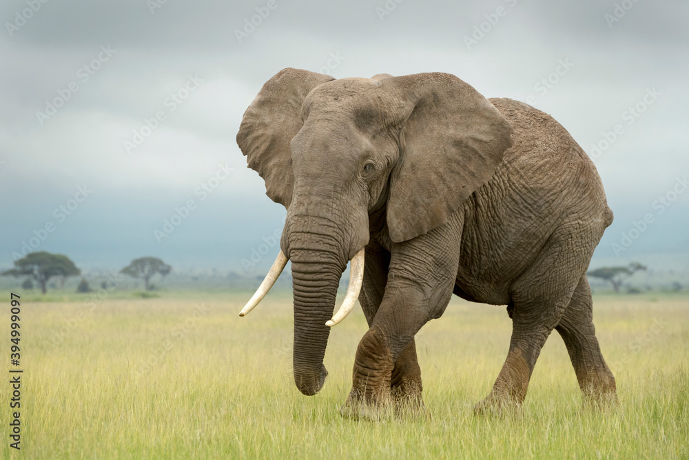
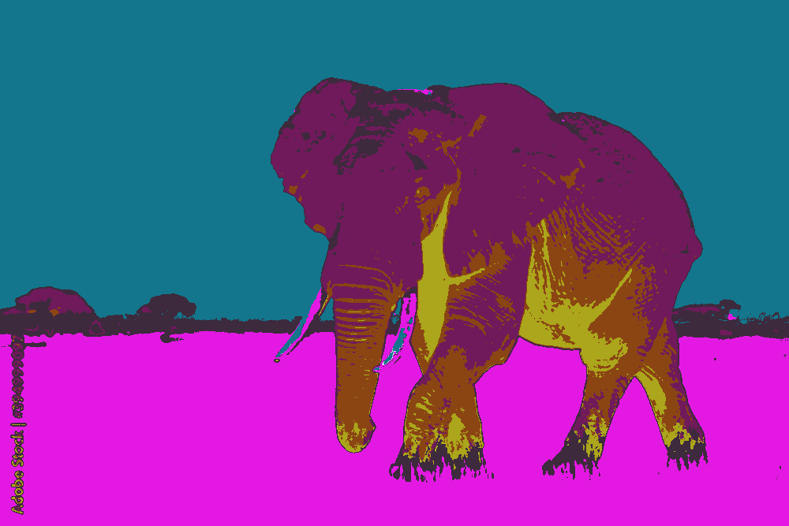
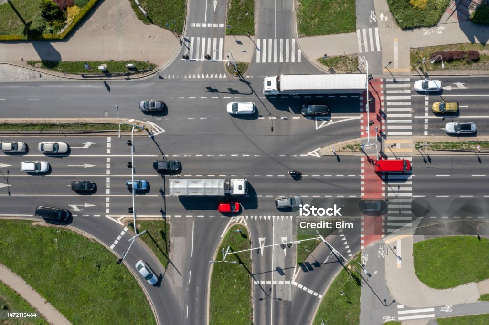
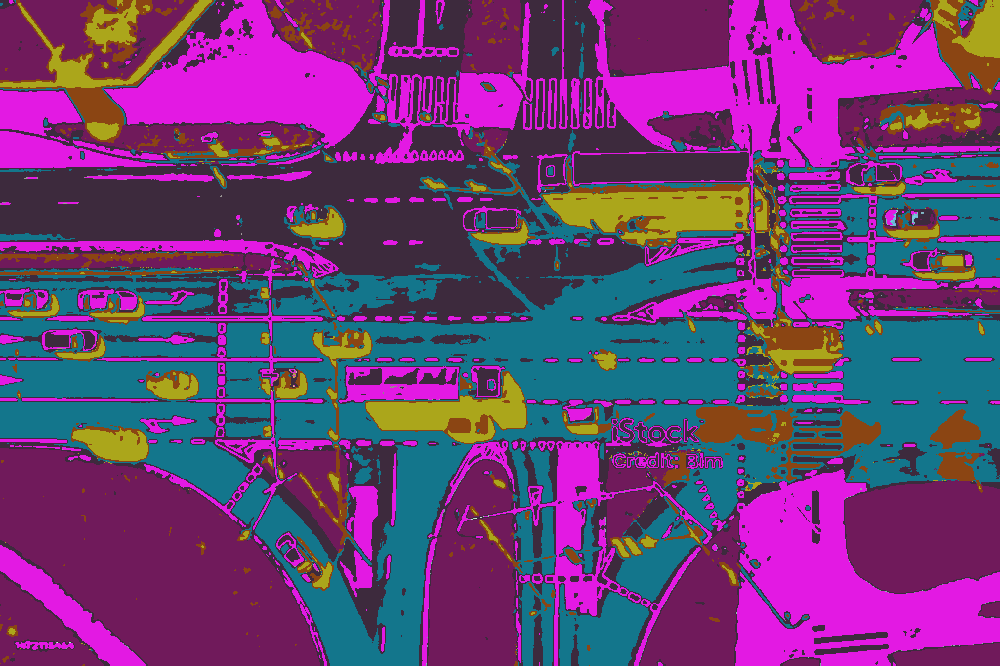

# Image Segmentation using GMM-EM

This project implements **Image Segmentation** using **Gaussian Mixture Models (GMM)** with **Expectation Maximization (EM)** based on both color and texture descriptors.

---

## 🧠 Overview

The segmentation pipeline follows these steps:

- Apply a **Gaussian Filter** on the image.
- Convert the image to the **CIELAB color space**.
- Extract **Local Binary Patterns (LBP)** for capturing texture features.
- Flatten and normalize the image feature data.
- Model the data distribution using a **Gaussian Mixture Model (GMM)**.
- Use the **Expectation Maximization (EM)** algorithm to iteratively estimate the optimal parameters and assign clusters.
- Segment the image into meaningful regions based on learned clusters.

> ✅ Achieves up to **0.917 Jaccard similarity coefficient** on test images.

---

## 📊 Visualization

Below are example image pairs. Each row shows:
- Left: Input Image
- Right: Segmented Output using GMM-EM

| Input Image | Segmented Output |
|-------------|------------------|
|  |  |
|  |  |
|  |  |
|  |  |


---

## 🛠️ Setup Instructions

1. **Clone the repository:**
   ```bash
   git clone https://github.com/tashir0605/GaussianMixtureSeg.git
   cd GaussianMixtureSeg

   
   chmod +x run.sh
   ./run.sh
